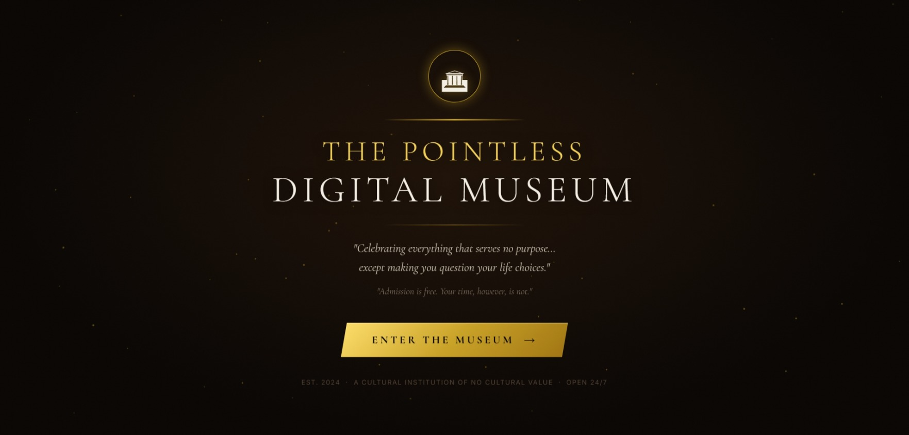




# THE POINTLESS DIGITAL MUSEUM 🎯


## Basic Details
### Team Name: The Pointless Curators


### Team Members
- Team Lead: VISHNU G - College of Engineering Adoor
- Member 2: PRINCY P - College of Engineering Adoor

### Project Description
An immersive, ultra-luxury 360° virtual museum website that treats completely ordinary, useless, and absurd everyday objects (and overthinking classical statues) as priceless historical artifacts with prestigious museum curation and hilarious commentary.

### The Problem (that doesn't exist)
Billions of perfectly useless objects—such as single socks missing their pairs since 2019, dead ballpoint pens that only worked in the store, and tangled cables compatible with no known technology—suffer from severe under-appreciation and a total lack of dedicated classical architectural exhibition spaces.

### The Solution (that nobody asked for)
We constructed a cinematic, multi-room digital Louvre featuring Carrara marble columns, golden chandelier lighting, crystal-clear glass display cases with real-time refraction, and 10 classical Greek/Roman statues wearing pixel sunglasses and browsing smartphones, accompanied by pretentious audio guide docent commentary and synthesized Web Audio sound effects.

## Technical Details
### Technologies/Components Used
For Software:
- **Languages used:** JavaScript (ES6+ Modules), HTML5, CSS3
- **Frameworks used:** Three.js (r158)
- **Libraries used:** GSAP 3 (GreenSock Animation Platform)
- **Tools used:** Web Audio API (procedural synthesis for 10 unique statue sound effects), Web Speech API (`SpeechSynthesis` for docent voiceover), HTML5 Canvas 2D API (procedural marble, wood grain, and sign textures), Node.js, Visual Studio Code / Antigravity

For Hardware:
- *Not applicable (Pure Software Project)*

### Implementation
For Software:
# Installation
```bash
git clone https://github.com/PRINCYPRAMOD/The-Pointless-Digital-Museum.git
cd The-Pointless-Digital-Museum
```

# Run
```bash
# Option 1: Run with Node.js
node server.js

# Option 2: Double-click start.bat (Windows)
start.bat
```
Then open your browser and visit:
```
http://localhost:3000
```

### Project Documentation
For Software:

# Screenshots (Add at least 3)

*The Grand Entrance & Landing Page with gold typography and animated dust particles*


*360° Grand Entry Hall featuring classical columns, interactive reception bell, and The Overthinker statue with pixel sunglasses*


*The Permanent Collection with ultra-clear glass display cases, rotating 3D exhibits, and Close-Up Inspection Mode*

# Diagrams
```
┌─────────────────────────────────────────────────────────────┐
│                 The Pointless Digital Museum                │
├──────────────────────────────┬──────────────────────────────┤
│       Grand Entry Hall       │    The Permanent Collection  │
│  - 360° First-Person View    │  - 10 Spotlight Display Cases│
│  - Reception Service Bell    │  - Close-Up Inspection Zoom  │
│  - Complaints Shredder Box   │  - 360° Rotating Artifacts   │
│  - Red Laser Tripwire Alarm  │  - Uselessness Score Meter   │
│  - 5 Classical Statues       │  - 5 Classical Statues       │
└───────────────▲──────────────┴──────────────▲───────────────┘
                │                             │
    ┌───────────┴─────────────────────────────┴───────────┐
    │              Audio & Interactive Systems            │
    │  - Web Audio API Procedural Sound Effects Engine     │
    │  - Web Speech API Pretentious Docent Voiceover      │
    │  - Raycaster 3D Click & Drag Navigation             │
    └─────────────────────────────────────────────────────┘
```
*Architecture and interactive feature map of the 3D museum experience*

For Hardware:
*(Not applicable for software project)*

### Project Demo
# Video
[Add your demo video link here]
*Demonstrates 360° first-person navigation, close-up exhibit inspection, clicking classical statues with sound effects, and docent voice commentary.*

# Additional Demos
- Live Hosted Link: `https://the-pointless-digital-museum.netlify.app`

## Team Contributions
- **VISHNU G**: 3D scene architecture, Three.js room geometry, lighting, camera fly-through navigation, and classical statue modeling.
- **PRINCY P**: Web Audio procedural sound effects engine, UI overlays, docent speech commentary, exhibit curation, and humorous captions.

---
Made with ❤️ at TinkerHub Useless Projects 


